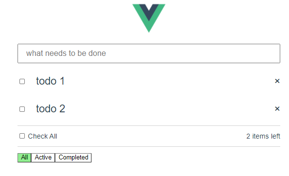

# Todo-Vue

Ett frontend projekt i vue och ett api för backend. 

Frontend: --> http://localhost:8080/ 

### Design 

  

### Build Setup

## install dependencies
npm install

## serve with hot reload at localhost:8080
npm run dev

## build for production with minification
npm run build

## run serve
npm run serve
